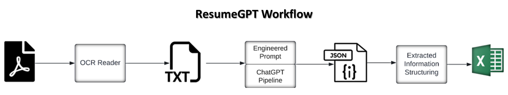

# CVsAgent

> AI-powered CV / resume intelligence — extract structured data from a stack
> of PDF / DOCX résumés and export a clean spreadsheet in one command.

[](LICENSE)
[](#requirements)
[](https://langchain.com)

CVsAgent turns a folder of résumés into a single tabular report: names,
contact details, education, work history, skills, certifications, and a
0–10 candidate rating — plus any custom fields you define and an optional
match score against a specific job description.



---

## Quick Start

```bash
git clone https://github.com/Aillian/CVsAgent.git && cd CVsAgent
pip install -r requirements.txt && cp .env.example .env  # add OPENAI_API_KEY
python main.py --skip-prompts
```

---

## Why CVsAgent?

- **No manual copy-paste** — drop in thousands of CVs, get one clean spreadsheet in minutes instead of hours.
- **Privacy-first** — run fully offline with Ollama; no candidate data ever has to leave your machine.
- **Extensible** — add any custom field with a single flag; no code changes needed.

---

## Features

- 📋 **24+ structured fields** per candidate (identity, education, work history, skills, projects, certs, languages, rating).
- 📄 **PDF and DOCX** input, with an optional **OCR fallback** for scanned PDFs.
- ➕ **Custom fields** — extract anything extra with `--add-fields VisaStatus DriverLicense …`.
- 🎯 **Job-description matching** — pass a JD and get a suitability flag + reason per candidate.
- 📊 **Multiple output formats**: `xlsx`, `csv`, `json`. Timestamped filenames by default.
- 🧠 **Pluggable LLM backend** — OpenAI by default, or fully local via [Ollama](https://ollama.com).
- 🔒 **Pre-run cost estimate** and interactive **PII warning** before data leaves your machine.
- ⚡ **Content-hash cache** — re-running skips files that were already processed.
- 🔄 **Retry with exponential backoff** on transient LLM failures; partial results are streamed to disk so a crash never loses work.
- 📈 **Rich progress bar** with ETA.
- 🐳 **Docker-ready** multi-stage image with a non-root user and a UI target wired up for a future web interface.

---

## Requirements

- Python **3.10+**
- An **OpenAI API key** (or a local Ollama server — see [Local models](#local-models))
- Optional: `tesseract` + `poppler` on PATH if you want OCR for scanned PDFs

---

## Installation

### Option 1 — Local

```bash
git clone https://github.com/Aillian/CVsAgent.git
cd CVsAgent
python -m venv .venv && source .venv/bin/activate   # Windows: .venv\Scripts\activate
pip install -r requirements.txt
cp .env.example .env   # then edit .env and add your OPENAI_API_KEY
```

### Option 2 — Docker

```bash
cp .env.example .env   # add your OPENAI_API_KEY
docker compose build
docker compose run --rm cli --help
```

Your host's `CVs/` and `output/` folders are mounted into the container, so
files you drop into `./CVs/` show up inside the container automatically.

---

## Usage

Drop your résumés into `CVs/` (PDF or DOCX), then run:

```bash
python main.py --skip-prompts
```

The first run prints a cost estimate and asks for confirmation before sending
any data to OpenAI. The `--skip-prompts` flag skips those prompts — omit it for an
interactive run.

### Common recipes

```bash
# Match every CV against a specific job description
python main.py --job-description-file job_descriptions/job_description.txt

# Add custom fields to the output
python main.py --add-fields VisaStatus DriverLicense GitHubStars

# Switch output format
python main.py --format csv
python main.py --format json --output-file results.json

# Use a local model instead of OpenAI (requires `pip install langchain-ollama`
# and a running Ollama server)
python main.py --provider ollama --model llama3.1

# Preview what would run — loads CVs and prints a cost estimate but never
# calls the LLM
python main.py --dry-run --skip-prompts

# Start from scratch (clear the cache of previously-processed CVs)
python main.py --clear-cache --no-cache
```

### All CLI flags

| Flag | Default | Description |
|------|---------|-------------|
| `--cv-dir` | `CVs` | Directory containing the input PDF/DOCX files. |
| `--output-dir` | `output` | Directory for the generated report. |
| `--output-file` | *auto* | Explicit output filename (overrides auto-timestamped name). |
| `--format` | `xlsx` | Output format: `xlsx`, `csv`, or `json`. |
| `--provider` | `openai` | LLM provider: `openai` or `ollama`. |
| `--model` | `gpt-5-mini-2025-08-07` | Model name (default depends on provider). |
| `--api-key` | — | API key (prefer `OPENAI_API_KEY` in `.env`). |
| `--ollama-base-url` | `http://localhost:11434` | Ollama server URL. |
| `--rate-limit-rps` | `0.5` | OpenAI rate limit in requests per second. |
| `--batch-workers` | `4` OpenAI / `1` Ollama | Maximum concurrent LangChain batch extractions. |
| `--add-fields` | — | Extra fields to extract, space-separated. |
| `--job-description` | — | Job description text to match candidates against. |
| `--job-description-file` | — | Path to a text file with the job description. |
| `--no-cache` | *off* | Disable the on-disk extraction cache. |
| `--clear-cache` | *off* | Clear the cache before running. |
| `--cache-dir` | `.cvsagent_cache` | Cache directory. |
| `--ocr` | *off* | Run OCR on PDFs that yield no text. |
| `--dry-run` | *off* | Load + cost-estimate only, no LLM calls. |
| `--skip-prompts`, `-s` | *off* | Skip all interactive prompts. |
| `--verbose`, `-v` | *off* | Debug-level logging. |
| `--log-file` | — | Mirror logs to a file. |
| `--version` | — | Print version and exit. |

### Environment variables

All of these are optional — the CLI flags take precedence.

| Variable | Purpose |
|----------|---------|
| `OPENAI_API_KEY` | Required for the OpenAI provider. |
| `CVSAGENT_PROVIDER` | `openai` or `ollama`. |
| `CVSAGENT_MODEL` | Default model name. |
| `OLLAMA_BASE_URL` | Ollama server URL. |
| `CVSAGENT_RATE_LIMIT_RPS` | OpenAI rate limit (requests/sec). |
| `CVSAGENT_BATCH_WORKERS` | Maximum concurrent LangChain batch extractions. |
| `CVSAGENT_CV_DIR` | Default input directory. |
| `CVSAGENT_OUTPUT_DIR` | Default output directory. |
| `CVSAGENT_CACHE_DIR` | Default cache directory. |

---

## Extracted fields

Per candidate you get:

- **Identity & contact** — Full Name, Email, Phone, LinkedIn URL, Portfolio URLs, City, Country
- **Professional summary** (≤100 words)
- **Education** — University, degree, major, GPA, graduation date (per degree)
- **Work experience** — Companies, job titles, current-role flag, top responsibilities
- **Computed** — Years of experience, management level
- **Skills** — Top 5 technical, top 5 soft, languages + proficiency
- **Achievements** — Top 5 projects, certifications, awards
- **Analysis** — Nationality, employment status, top 5 suitable positions, overall rating (0–10)
- **Dynamic** — your `--add-fields` plus optional `Target Role Match` + `Match Reason` when you supply a job description

---

## Local models

CVsAgent works end-to-end without ever leaving your machine:

```bash
# 1. Run Ollama and pull a model
ollama run llama3.1

# 2. Install the provider bridge
pip install langchain-ollama

# 3. Point CVsAgent at it
python main.py --provider ollama --model llama3.1
```

No API key is required and no CV content is transmitted to a third party.

---

## Running tests

The test suite drives the real CLI end-to-end with a mock LLM — no network
calls, no API key needed.

```bash
pip install pytest python-docx
pytest -q
```

---

## Project layout

```
.
├── main.py                       # thin CLI entrypoint
├── cvs_agent/                    # core package
│   ├── app.py                    # CLI + orchestration
│   ├── config.py                 # constants, RunConfig
│   ├── console.py                # shared Rich logger
│   ├── loader.py                 # PDF + DOCX (+ optional OCR)
│   ├── pipeline.py               # LangChain agent (OpenAI / Ollama)
│   ├── prompts.py                # system prompt builder
│   ├── schema.py                 # Pydantic CVData model
│   ├── mapper.py                 # nested dict -> flat row
│   ├── exporter.py               # xlsx / csv / json writers
│   ├── cache.py                  # SHA-256 keyed result cache
│   └── utils.py
├── tests/                        # end-to-end CLI integration tests
├── assets/                       # docs images
├── job_descriptions/             # sample JD
├── Dockerfile                    # multi-stage, UI-ready
├── docker-compose.yml            # cli + future ui profile
└── requirements.txt
```

---

## Roadmap

- Web UI (in `Dockerfile` stage `ui`, `docker-compose.yml` profile `ui`) — planned after the current hardening cycle.

---

## Contributing

Contributions are welcome — please read [CONTRIBUTING.md](CONTRIBUTING.md). Security issues: see
[SECURITY.md](SECURITY.md).

## License

[MIT](LICENSE) © Ali Abuharb

Created With 💜 By **Ali Abuharb**. Let's Connect on [LinkedIn](https://www.linkedin.com/in/ali-abuharb-3b4905153)
